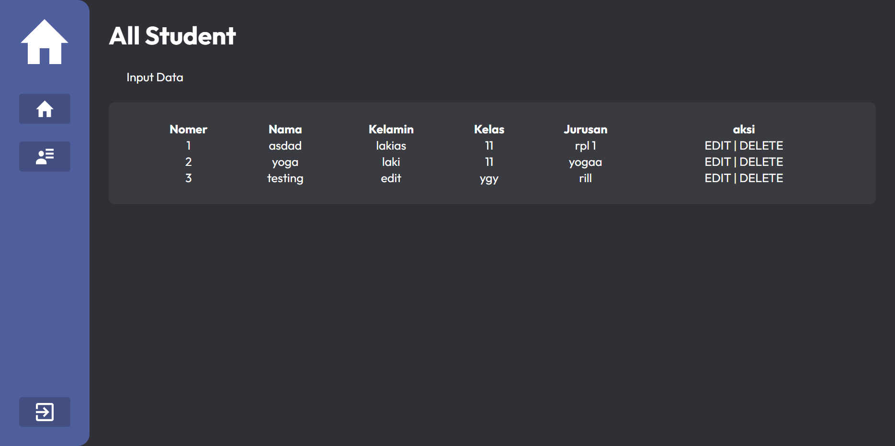
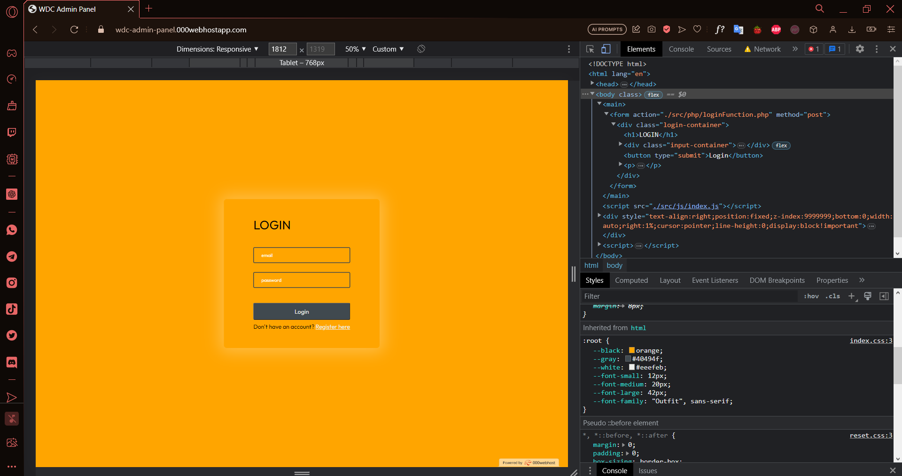
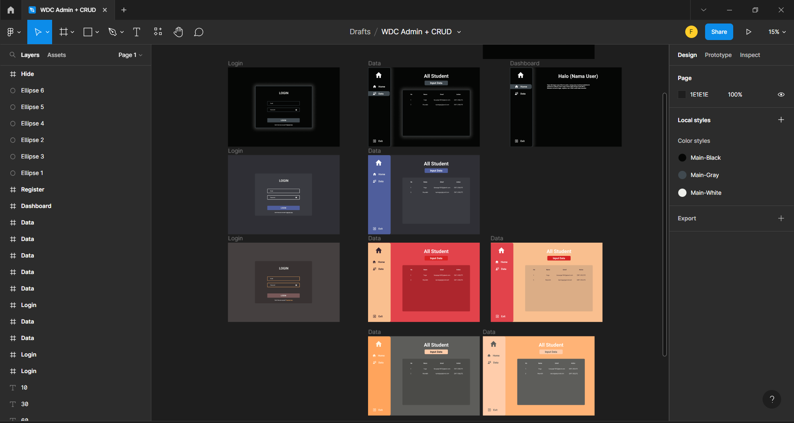

# WDC Admin Panel
WDC Admin Panel adalah sebuah website admin panel yang memudahkan pengguna dalam mengelola data siswa. Dengan fitur login dan register, pengguna dapat mengakses dua bagian utama dari admin panel, yaitu menjelaskan tentang proyek yang dibuat dan mengelola data siswa melalui fitur CRUD. Dengan antarmuka yang intuitif dan fitur yang kuat, WDC Admin Panel membantu pengguna dalam mengedit, menghapus, menambahkan, dan melihat data siswa dengan efisien dan efektif.

## Table of contents

- [Overview](#overview)
  - [Screenshot](#screenshot)
  - [Links](#links)
- [My process](#my-process)
  - [Built with](#built-with)
- [Author](#author)

## Overview

### Screenshot

### Links

- Live Site URL: [Live Site](https://wdc-admin-panel.000webhostapp.com)

## My process

### Built with

- PHP
- Semantic HTML5 markup
- CSS custom properties
- Flexbox

## Author

- Frontend Mentor - [@Fxanz](https://www.frontendmentor.io/profile/Fxanz)
- Twitter - [@IFxanz](https://www.twitter.com/IFxanz)
